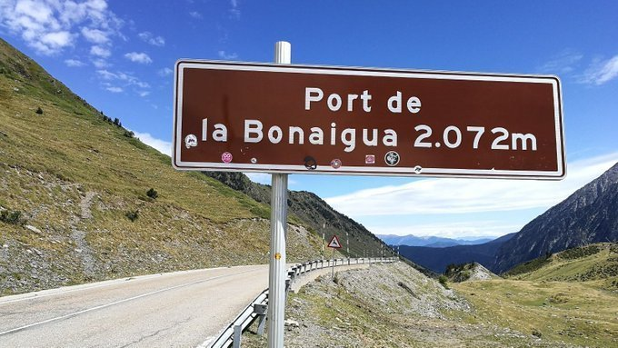

## Informació sobre la tasca

El lliurament serà en format PDF. Llegir [Lliurament i presentació de tasques](/posts/entrega-presentacio-tasques/).

La tasca es qualifica amb una nota d'APTE (10) o NO APTE (0).

Durada activitats obligatòries: 6 hores.

RA2.

# Exercicis Mni ER - La Volta

Dissenyeu petits diagrames ER per cada exercici. En els subapartats de cada exercici intenta de reutilitzar els elements de diagrames anteriors.

Si et veus capaç crea una sol diagrama ER tenint en compte els diferents enunciats dels diferents exercicis 

## Ex 1 – Etapes de La Volta 
Les etapes de La Volta s’identifiquen per un número correlatiu, a comptar a partir de l’1, que com és lògic s’associa a la primera etapa, a continuació el 2 s’associa a la segona, i així successivament fins a l’última. Cada etapa comença en una localitat i acaba en una altra. La localitat d'arribada pot ser la mateixa que la de sortida si l'etapa és circular.

Ens cal saber la data en la qual es desenvolupen les etapes. No hi pot haver cap etapa que duri més d'un dia. També ens diuen que cal guardar el total de Kms de cada etapa.

## Ex 2 – Ports de muntanya en les etapes 

Cada etapa de La Volta pot incloure un o més ports de muntanya (o cap), però cada port només pot estar inclòs dins d’una etapa. Dels ports de muntanya ens interessa saber el seu topònim i la seva alçada en metres.

## Ex 3 – Províncies en les etapes

Cada etapa de La Volta passa pel territori d’una o més províncies, però per una mateixa província pot passar més d’una etapa (o cap). Cal registrar el total de km de cada etapa que travessen per cada província. Per exemple, a l'etapa 2 es travessa 35 km per la província de Barcelona i 47 km per la província de Tarragona. 

## Ex 4 - Mallot dels ciclistes en les etapes

La nostra base de dades ha de poder registrar quin ciclista porta cada mallot (general, punts, muntanya, etc.) a cada etapa de La Volta. Cada mallot s’identifica gràcies a un codi (3 lletres) i un color determinat. Els ciclistes s’identifiquen per un dorsal, i a la BD ha de constar també el seu nom i cognoms i la seva data de naixement.

