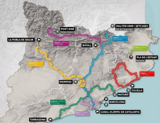
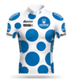

## Informació sobre la tasca

El lliurament serà en format PDF. Llegir [Lliurament i presentació de tasques](/posts/entrega-presentacio-tasques/).

La tasca es qualifica amb una nota d'APTE (10) o NO APTE (0).

Durada activitats obligatòries: 6 hores.

RA2.

# Exercicis Mni ER - La Volta

Dissenyeu petits diagrames ER per cada exercici. En els subapartats de cada exercici intenta de reutilitzar els elements de diagrames anteriors.

Si et veus capaç crea una sol diagrama ER tenint en compte els diferents enunciats dels diferents exercicis 

## Ex 1 – Etapes de La Volta 
Les etapes de La Volta s’identifiquen per un número correlatiu, a comptar a partir de l’1, que com és lògic s’associa a la primera etapa, a continuació el 2 s’associa a la segona, i així successivament fins a l’última. Cada etapa comença en una localitat i acaba en una altra. La localitat d'arribada pot ser la mateixa que la de sortida si l'etapa és circular.

Ens cal saber la data en la qual es desenvolupen les etapes. No hi pot haver cap etapa que duri més d'un dia. També ens diuen que cal guardar el total de Kms de cada etapa.

## Ex 5 – Sistema de punts per saber qui és el millor escalador 

Els ports de muntanya s’identifiquen pel seu topònim, i tenen una una alçada determinada per sobre del nivell del mar. 

Depenent de la dificultat els ports es classifiquen en quatre categories (especial, 1a, 2a i 3a). 

Cal dissenyar un sistema per tal d’emmagatzemar els punts que poden assolir els ciclistes segons la posició en què arribin a cada port segons es detalla a continuació.

|             | **Categoria  Especial** | **Primera categoria** | **Segona categoria** | **Tercera categoria** | **Quarta categoria** |
|-------------|-------------------------|-----------------------|----------------------|-----------------------|----------------------|
| **Posició** | _Punts_                 | _Punts_               | _Punts_              | _Punts_               | _Punts_              |
| **1r**      | 20                      | 10                    | 5                    | 2                     | 1                    |
| **2a**      | 16                      | 8                     | 3                    | 1                     |                      |
| **3a**      | 12                      | 6                     git push origin main| 2                    |                       |                      |
| **4a**      | 8                       | 4                     | 1                    |                       |                      |
| **5a**      | 4                       | 2                     |                      |                       |                      |
| **6a**      | 2                       | 1                     |                      |                       |                      |

## Ex 6 – Sistema de punts per saber el millor ciclista per punts

Seguint el mateix funcionament que el Tour de França es determinarà el sistema de puntuació per aconseguir el mallot verd.

Cada etapa es categoritzarà en: etapa plana, etapa mitja muntanya, etapa de muntanya, contrarellotge individual.

Els punts s'obtindran per el primers llocs de cada etapa i en funció de la seva categoria.
La distribució de punts es realitzarà mitjançant la següent taula:
* Etapes planes: 50, 30, 20, 18, 16, 14, 12, 10, 8, 7, 6, 5, 4, 3 y 2 punts respectivament des del primer fins el quinzè ciclista en arribar a la meta.
* Etapes de mitja muntanya: 30, 25, 22, 19, 17, 15, 13, 11, 9, 7, 6, 5, 4, 3 y 2 punts respectivament des del primer fins el quinzè ciclista en arribar a la meta.
* Etapes de muntanya i contrarellotges individuals: 20, 17, 15, 13, 12, 10, 9, 8, 7, 6, 5, 4, 3, 2 y 1 punts respectivament des del primer fins el quinzè ciclista en arribar a la meta. 

## Ex 7 – Ciclistes i classificacions

Ara que ja s'han explicat els diferents tipus de premis que pot aconseguir un ciclista juntament amb les dades bàsiques que cal guardar de cadascun d'ells cal dissenyar quelcom per poder generar les classificacions dels següents mallots: general, punts i muntanya.

**_Important: No s'ha de dissenyar res per guardar les classificacions sinó aquelles dades necessàries per poder-les generar._**
