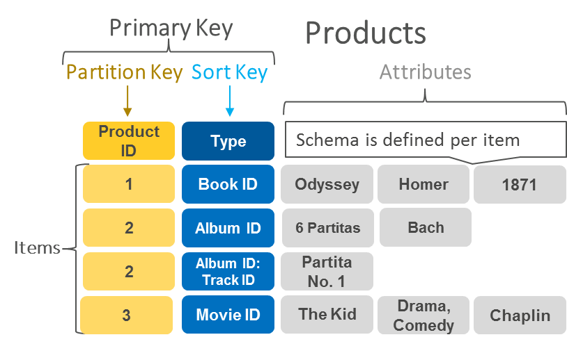

## Informació sobre la tasca

El lliurament serà en format PDF. Llegir [Lliurament i presentació de tasques](/posts/entrega-presentacio-tasques/).

La tasca es qualifica amb una nota de 0  a 10 

Durada activitats obligatòries: 6 hores.


## Activitats

# 1. Bases de dades NoSQL

Les bases de dades **no relacionals** o **NoSQL** ens permeten emmagatzemar informació en situacions en què les bases de dades relacionals poden tenir problemes d’escalabilitat i rendiment. Aquestes bases de dades estan dissenyades per a models de dades específics i tenen esquemes flexibles.

**Exemple:**

Per exemple, suposem que volem modelar l’esquema d’una base de dades senzilla per emmagatzemar llibres.

Si utilitzéssim una **base de dades relacional**, emmagatzemaríem la informació en diferents taules, que estarien relacionades entre si mitjançant restriccions de claus primàries i foranes. El model relacional està dissenyat per permetre que existeixi integritat referencial entre taules i per reduir la redundància de la informació mitjançant la normalització.

En aquest exemple, tindríem les taules següents:

* **`llibres`** (**`isbn`**, **`títol`**, **`any_edicio`**)
* **`autors`** (**`id_autor`**, **`nom_autor`**)
* **`autor_isbn`** (**`id_autor`**, **`isbn`**)

En una **base de dades NoSQL**, el registre d’un llibre es pot emmagatzemar en un únic document **`JSON`**. A diferència del model relacional, podem incloure informació relacionada, com ara els autors, dins del mateix document mitjançant l’ús de llistes o altres objectes niats, evitant així la necessitat de realitzar operacions **`JOIN`**.

```json
{
    "isbn": 9788448190330,
    "títol": "Fundamentos de Bases de Datos",
    "any_edicio": 2015,
    "autors": [
        {
            "id_autor": 11,
            "nom_autor": "Abraham Silverschatz"
        },
        {
            "id_autor": 12,
            "nom_autor": "Henry F. Korth"
        }
    ]
}
```

## 1.1. Característiques de les bases de dades NoSQL

* No compleixen l’esquema entitat-relació.
* No utilitzen estructures fixes d’emmagatzematge com ara les taules.
* Aquestes bases de dades tenen esquemes de dades flexibles, cosa que fa que siguin ideals per a aplicacions que treballen amb dades semiestructurades i no estructurades.
* Normalment no admeten operacions de tipus **`JOIN`**.
* Tradicionalment no garanteixen les propietats ACID (Atomicitat, Consistència, Aïllament i Durabilitat) per afavorir l’escalabilitat, tot i que molts sistemes moderns (com MongoDB o DynamoDB) ja admeten transaccions ACID multidocument.

## 1.2. El teorema CAP

Per entendre per què existeixen tants tipus de bases de dades NoSQL, és fonamental conèixer el **teorema CAP**, també conegut com a **teorema de Brewer**. Aquest teorema afirma que en un sistema distribuït és impossible garantir simultàniament més de dues de les tres propietats següents:

* **Consistència (*****Consistency*****)**: Tots els nodes veuen les mateixes dades al mateix temps.
* **Disponibilitat (*****Availability*****)**: Cada petició rep una resposta d’èxit o de fallada, sense garantia que contingui la versió més recent.
* **Tolerància a la partició (*****Partition Tolerance*****)**: El sistema continua funcionant malgrat la pèrdua de missatges o la fallada d’una part del sistema.

Atès que en un sistema distribuït la **tolerància a la partició** és obligatòria per evitar caigudes totals, les bases de dades han de triar entre ser **CP** (Consistents i Tolerants a la partició) o **AP** (Disponibles i Tolerants a la partició).

## 1.3. Tipus de bases de dades NoSQL

### 1.3.1. Bases de dades de tipus clau-valor

Les bases de dades clau-valor són altament divisibles i permeten un escalat horitzontal a escales que altres tipus de bases de dades no poden assolir.

 .


> Imatge: Exemple d’una base de dades clau-valor. [**Amazon Web Services**](https://aws.amazon.com/es/nosql/).

**Casos d’ús**

* Emmagatzematge de sessions.
* Carret de la compra.
* Jocs.
* IoT.

**Exemples de bases de dades de tipus clau-valor**

* [**Redis**](https://redis.io/).
* [**Amazon DynamoDB**](https://aws.amazon.com/es/dynamodb/).
* [**Riak**](https://riak.com/).

**Tutorials**

* [**Getting started with redis**](https://riptutorial.com/redis)
* [**Learning Redis**](https://riptutorial.com/Download/redis.pdf)
* [**Quickstart: How to Use Redis on Java**](https://dzone.com/articles/quickstart-how-to-use-redis-on-java). 2019. DZone.
* [**A Docker/docker-compose setup with Redis and Node/Express**](https://codewithhugo.com/setting-up-express-and-redis-with-docker-compose/). 2018.

**Pràctica amb Redis**

* **Servidor:**

  Iniciem un contenidor Docker amb **`redis`** al port **`6379`**.

```bash
docker run --rm --name redis-server -p 6379:6379 redis
```

* **Client:**

  Iniciem un contenidor Docker amb **`redis-cli`** que es connecta amb el servidor **`redis`** que hem creat en el pas anterior. Utilitzem el paràmetre **`--raw`** perquè els caràcters especials, com ara accents o signes d’exclamació, es mostrin correctament.

```bash
docker run -it --rm --link redis-server:redis-server redis redis-cli -h redis-server -p 6379 --raw
```

Per emmagatzemar valors utilitzem **`SET`**.

```text
redis-server:6379> SET miclave "¡Hola mundo!"
OK
```

Per recuperar valors utilitzem **`GET`**.

```text
redis-server:6379> GET miclave
"\xc2\xa1Hola mundo!"
```

**Casos d’ús de Redis**

* [**Top 5 Redis Use Cases**](https://www.youtube.com/watch?v=a4yX7RUgTxI). ByteByteGo.

### 1.3.2. Bases de dades de tipus documents `JSON`

En algunes aplicacions, les dades es representen com un objecte o un document de tipus **`JSON`**, perquè és un model de dades intuïtiu per als desenvolupadors. Les bases de dades de **`JSON`** tenen una naturalesa flexible i faciliten als desenvolupadors l’emmagatzematge i la consulta de dades.

Internament, sistemes com **MongoDB** utilitzen un format binari anomenat **BSON** (Binary JSON), que permet emmagatzemar més tipus de dades (com ara dates o dades binàries) i fer cerques més eficients.

**Exemple**

Exemple d’un document **`JSON`** que descriu una pel·lícula.

```json
{
    "year": 2019,
    "title": "Avengers: Endgame",
    "info": {
        "directors": [
            "Anthony Russo",
            "Joe Russo"
        ],
        "release_date": "2019-04-25T00:00:00Z",
        "rating": 8.8,
        "genres": [
            "Action",
            "Adventure",
            "Sci-Fi"
        ],
        "image_url": "https://your.server.com/images/avengers.jpg",
        "plot": "After the devastating events of Vengadores: Infinity War (2018), the universe is in ruins. With the help of remaining allies, the Avengers assemble once more in order to undo Thanos' actions and restore order to the universe.",
        "actors": [
            "Robert Downey Jr.",
            "Chris Evans",
            "Mark Ruffalo"
        ]
    }
}
```

**Casos d’ús**

* Administració de continguts, com ara blogs i plataformes de vídeo.
* Catàlegs, com ara els productes d’una aplicació de comerç electrònic.

**Exemples de bases de dades comercials de tipus documents** **`JSON`**

* [**MongoDB**](https://www.mongodb.com/).
* [**Couchbase**](https://www.couchbase.com/).
* [**Amazon DocumentDB**](https://aws.amazon.com/es/documentdb/).

**Tutorials**

* [**MongoDB Hello World — How to connect, insert and find data**](https://medium.com/@gflourenco/mongodb-hello-world-how-to-connect-insert-and-find-data-7bf69438133e). 2018. Medium.

**Pràctica amb MongoDB**

* **Servidor:**

  Iniciem un contenidor Docker amb **`mongo`**.

```bash
docker run -d --rm --name mongo-server mongo
```

* **Client:**

  Iniciem un contenidor Docker amb un client de **`mongo`** que es connecta amb el servidor **`mongo`** que hem creat en el pas anterior.

```bash
docker run -it --rm --link mongo-server mongo mongosh --host mongo-server
```

Un cop ens hem connectat amb el servidor Mongo, podem executar les ordres següents. En primer lloc, llistem totes les bases de dades que existeixen al servidor.

```javascript
show databases
```

Per seleccionar una base de dades existent o per crear-ne una de nova utilitzem l’ordre **`use`**. Per exemple, l’ordre següent crearà una base de dades anomenada **`botiga`**.

```javascript
use botiga
```

Per llistar les col·leccions de documents que existeixen a la base de dades utilitzem l’ordre **`show collections`**.

```javascript
show collections
```

Com que acabem de crear la base de dades, l’ordre anterior no retornarà cap resultat perquè encara no existeix cap col·lecció.

Crearem una col·lecció anomenada **`llibres`**.

```javascript
db.createCollection("llibres")
```

Ara inserim el primer document JSON a la col·lecció **`llibres`**.

```javascript
db.llibres.insertOne({
    titol: "Bases de dades NoSQL",
    autor: "Pepe"
})
```

També és possible inserir una llista de documents JSON en una única operació.

```javascript
db.llibres.insertMany([
    {
        titol: "Llibre A",
        autor: "Maria"
    },
    {
        titol: "Llibre B",
        autor: "Joan"
    }
])
```

Per obtenir la llista de documents de la base de dades utilitzem l’ordre **`find`**.

```javascript
db.llibres.find()
```

Podem formatar la sortida amb l’ordre **`pretty`**, per millorar la llegibilitat dels documents JSON (tot i que en les versions modernes de **`mongosh`** la sortida ja apareix formatada per defecte).

```javascript
db.llibres.find().pretty()
```

Si volguéssim fer una cerca sobre un autor concret, podem executar l’ordre següent.

```javascript
db.llibres.find({
    autor: "Pepe"
})
```

### 1.3.3. Bases de dades de tipus graf

Les bases de dades no relacionals basades en grafs utilitzen **nodes** per emmagatzemar les entitats de dades i **arestes** per emmagatzemar les relacions entre les entitats. Una aresta sempre té un node d’inici, un node final, un tipus i una direcció, i pot descriure relacions principals i secundàries, les accions, la propietat i aspectes similars. No hi ha cap límit en la quantitat ni en el tipus de relacions que pot tenir un node.

**Exemple**

Aquest exemple mostra com seria el graf d’una xarxa social. Les persones serien els nodes i les seves relacions serien les arestes. D’aquesta manera, és possible saber qui són els amics dels amics d’una persona específica.


 .

> Imatge: Exemple d’una base de dades basada en grafs. [**Amazon Web Services**](https://aws.amazon.com/es/nosql/).

**Casos d’ús**

* Detecció de fraus.
* Motors de recomanacions.

**Exemples de bases de dades de tipus graf**

* [**Neo4j**](https://neo4j.com/).
* [**InfiniteGraph**](https://infinitegraph.com/).

**Pràctica amb Neo4j**

* **Servidor:**

  Iniciem un contenidor Docker amb **`neo4j`**. El port **`7474`** és per a la interfície web i el **`7687`** per al protocol [**Bolt**](https://en.wikipedia.org/wiki/Bolt_%28network_protocol%29), que és un protocol binari de comunicació entre el client i el servidor.

```bash
docker run -d --rm --name neo4j-server \
    -p 7474:7474 \
    -p 7687:7687 \
    -e NEO4J_AUTH=none \
    neo4j
```

* **Client:**

  Podem utilitzar la interfície web a `http://localhost:7474` o connectar-nos mitjançant la consola amb **`cypher-shell`**.

```bash
docker exec -it neo4j-server cypher-shell
```

Un cop a dins (o al web), utilitzem el llenguatge **Cypher** per crear nodes i relacions.

```cypher
// Crear dos nodes de tipus Persona
CREATE (p1:Persona {nombre: "Pepe", edad: 25})
CREATE (p2:Persona {nombre: "María", edad: 30})

// Crear una relació d'amistat entre ells
MATCH (a:Persona {nombre: "Pepe"}), (b:Persona {nombre: "María"})
CREATE (a)-[:AMIGO_DE]->(b)

// Consultar els amics de Pepe
MATCH (p:Persona {nombre: "Pepe"})-[:AMIGO_DE]->(amigo)
RETURN amigo.nombre
```

### 1.3.4. Bases de dades orientades a columnes (Wide-column stores)

Les bases de dades orientades a columnes estan optimitzades per obtenir columnes de dades d’una manera molt ràpida i eficient. Han estat dissenyades per gestionar grans volums de dades en clústers distribuïts, cosa que les fa ideals per al processament de Big Data.

**Exemples de bases de dades orientades a columnes**

* [**Apache Cassandra**](https://cassandra.apache.org/).
* [**HBase**](https://hbase.apache.org/).

**Referències**

* [**Sistema gestor de base de dades orientat a columnes**](https://es.wikipedia.org/wiki/Sistema_gestor_de_base_de_datos_orientado_a_columnas).
* [**Base de dades columnar**](https://www.ionos.es/digitalguide/hosting/cuestiones-tecnicas/base-de-datos-columnar/).

**Pràctica amb Cassandra**

* **Servidor:**

  Iniciem un contenidor Docker amb **`cassandra`**.

```bash
docker run -d --rm --name cassandra-server cassandra
```

* **Client:**

  Iniciem un contenidor amb el client **`cqlsh`** que es connecta al servidor.

**Nota:** Cassandra pot trigar entre 30 i 60 segons a iniciar-se completament. Si en executar l’ordre següent reps un error de tipus **`Connection refused`**, espera uns instants i torna-ho a intentar.

```bash
docker exec -it cassandra-server cqlsh
```

Un cop a dins, podem crear un **`KEYSPACE`** i una taula.

Un **`KEYSPACE`** és l’equivalent a una base de dades o esquema en el món de les bases de dades relacionals. És un espai de noms que agrupa taules relacionades entre si.

```sql
CREATE KEYSPACE botiga
WITH replication = {
    'class': 'SimpleStrategy',
    'replication_factor': 1
};
```

El paràmetre **`replication`** indica com es replicaran les dades entre els nodes del clúster. En aquest cas, **`SimpleStrategy`** és una estratègia simple que replica les dades en un únic node (`replication_factor: 1`).

```sql
USE botiga;

CREATE TABLE usuaris (
    id int PRIMARY KEY,
    nom text,
    email text
);

INSERT INTO usuaris (id, nom, email)
VALUES (1, 'Pepe', 'pepe@gmail.com');

SELECT * FROM usuaris;
```

## 1.4. Quina base de dades NoSQL triar?

| Tipus           | Quan utilitzar-la                                                     | Exemples              |
| --------------- | --------------------------------------------------------------------- | --------------------- |
| **Clau-valor**  | Emmagatzematge simple, memòria cau, sessions, carrets de la compra.   | Redis, Riak, DynamoDB |
| **Documents**   | Dades semiestructurades, catàlegs, perfils d’usuari, blogs.           | MongoDB, CouchDB      |
| **Grafs**       | Relacions complexes, xarxes socials, recomanacions, frau.             | Neo4j, JanusGraph     |
| **Wide-column** | Escriptures massives, sèries temporals, registres d’activitat (logs). | Cassandra, HBase      |

## 1.5. Referències

El contingut d’aquest web s’ha extret de les referències següents:

* [**NoSQL**](https://es.wikipedia.org/wiki/NoSQL).
* [**Bases de datos NoSQL. Qué son y tipos que nos podemos encontrar**](https://www.acens.com/wp-content/images/2014/02/bbdd-nosql-wp-acens.pdf).
* [**¿Qué son las bases de datos NoSQL?**](https://aws.amazon.com/es/nosql/). Amazon Web Services.
